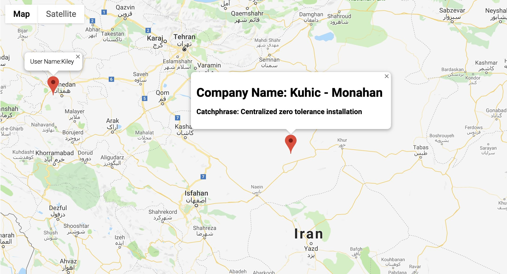

# Random map

## Description

Randomly generate User and Company, and then show  both locations on google map

**_DEMO:_**



## Requirement

- npm
- typescript
- ts-node </br>
`$ sudo npm install -g typescript ts-node`
- parcel bundler: compile `.ts` file to JS then replace this script tag in `index.html` </br>
`$  sudo npm install -g parcel-bundler`

## Usage

Clone repo, cd into folder then:

```
$ npm install
$ parcel index.html
```

-> Open http://localhost:1234 in your browser.

## Tools

- Faker: generate fake data
- Maps JavaScript API (Google API Console )